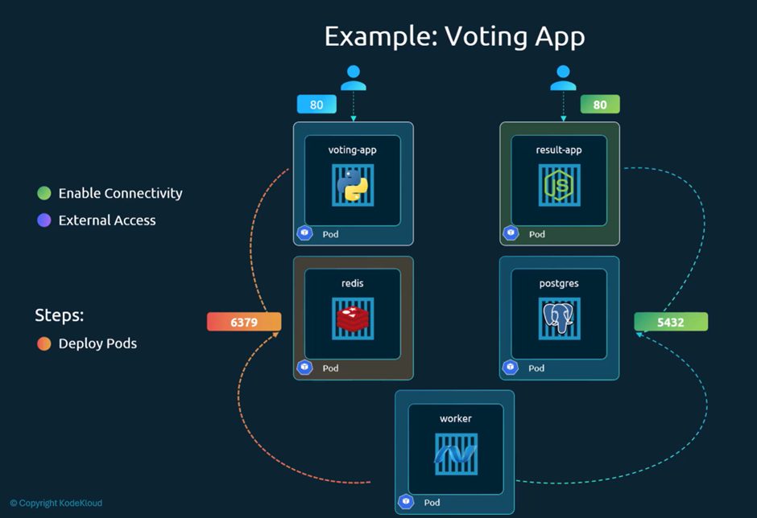
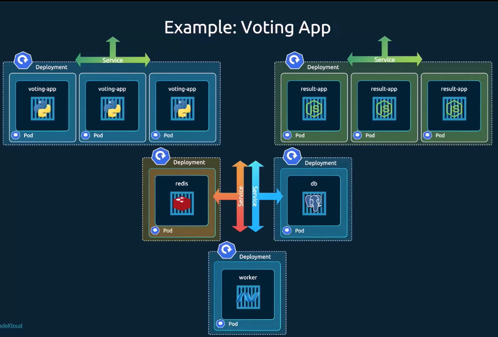

we need the cluster setup. 

kubectl get node
kubectl get pod
kubectl get svc

kubectl apply -f . # we can apply all folder inside this or 
kubectl apply -f db-pod.yaml # we can execute one by one

kubectl get pod
kubectl get service

kubectl get node -o wide # get ip address and go to browser for accessing the service

IP address: port like 31000 for voting
IP address: port like 31001 for showing the voting result

we need service from:
1. voting-app
2. redis
3. postgres
4. result-app

but worker is not providing any service. it has processed the activities.

